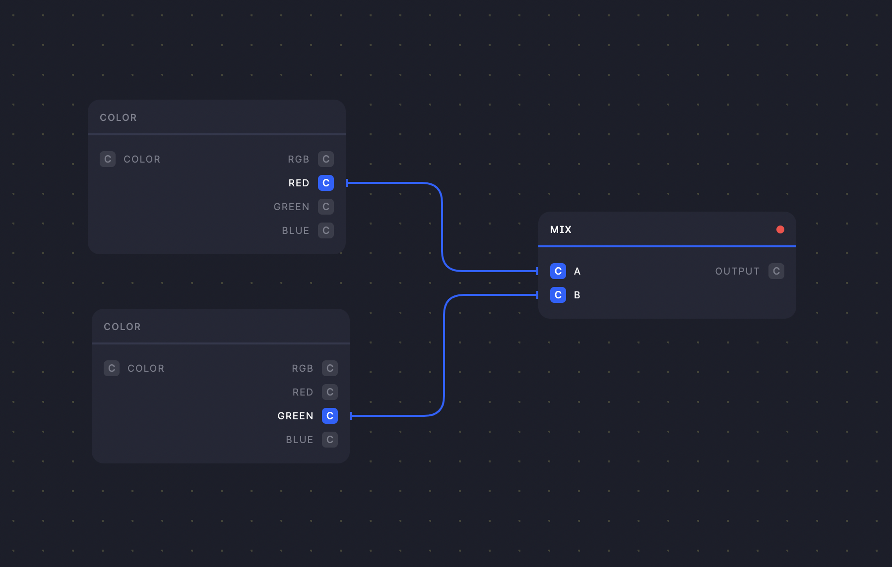

# Introduction

A framework for node-based applications. Leveraged by RxJS.

## Packages

Nodl is divided up into a core package, and several UI packages which implements components for Nodl's visual vision.

### @nodl/core

The core implementation of the Nodl framework. Exposes utilities and functions to define computational graphs.

[See package](/docs/packages/core)

### @nodl/react

A React implementation of the Nodl framework. Exposes components & utilities for rendering Nodl nodes & connections.

[See package](/docs/packages/react)

### @nodl/math

A library of pre-defined math nodes ready for use.

[See package](/docs/packages/math)
